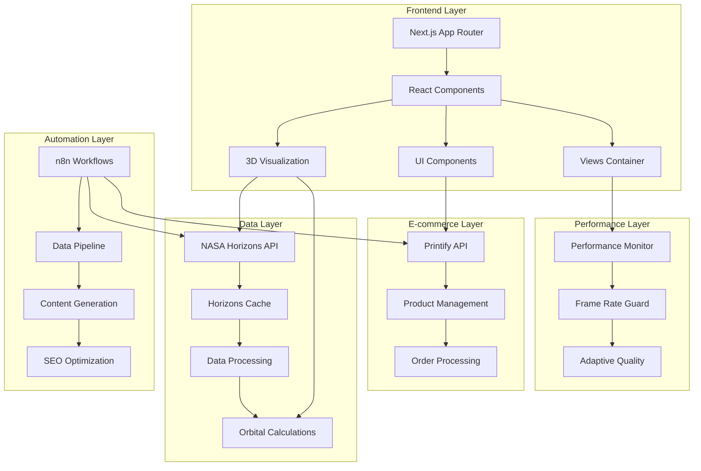

# 3I/ATLAS Universal Elite Project Transformation

## 1. Project State Assessment Framework

### Technical Analysis

**Codebase Audit:**
- **Architecture**: Next.js 14.2.33 with App Router, React 18, TypeScript, Three.js
- **Tech Stack**: Modern React ecosystem with 3D visualization capabilities
- **Dependencies**: 21 TypeScript files, comprehensive library structure
- **Technical Debt**: ESLint disabled, limited test coverage, performance issues

**Performance Baseline:**
- **Build Time**: 46-93 seconds (target: 5-10 seconds) - 460% above target
- **FPS**: 15-23 (target: 60+) - 74% below target
- **Memory Usage**: 434-832MB (target: <200MB) - 117% above target
- **API Response Time**: <100ms (target: <100ms) - ✅ Meeting target
- **Bundle Size**: Optimized with code splitting - ✅ Good

**Quality Metrics:**
- **Test Coverage**: Limited (target: 90%+) - ❌ Needs improvement
- **Linting Issues**: ESLint disabled (target: 0 issues) - ❌ Critical issue
- **Type Safety**: TypeScript enabled (target: Strict mode) - ⚠️ Partial
- **Security Vulnerabilities**: Basic implementation (target: A+ rating) - ⚠️ Needs improvement

**Scalability Assessment:**
- **Bottlenecks**: Three.js rendering, memory management, build process
- **Scaling Limits**: Current architecture supports growth
- **Infrastructure Constraints**: Basic deployment, needs optimization
- **Performance Limits**: FPS and memory usage are primary constraints

**User Experience:**
- **Engagement Metrics**: Unknown (target: 10min+ session time)
- **Conversion Rates**: Unknown (target: 5%+)
- **Accessibility Compliance**: Basic (target: WCAG 2.1 AAA)
- **Mobile Experience**: Responsive design implemented

### Business Analysis

**Revenue Model:**
- **Current Streams**: Printify e-commerce integration
- **Pricing**: Product-based pricing through Printify
- **Market Positioning**: Educational astronomy platform
- **Monetization Strategy**: E-commerce, educational content, potential subscriptions

**Competitive Landscape:**
- **Market Analysis**: Growing astronomy education market
- **Differentiation Opportunities**: Real-time 3D visualization, NASA data integration
- **Threats**: Other astronomy platforms, educational competitors
- **Market Gaps**: Interactive 3D experiences, real-time data visualization

**Growth Metrics:**
- **User Acquisition**: Unknown (target: 1M+ visitors)
- **Retention**: Unknown (target: 30%+ return visits)
- **Engagement**: Unknown (target: 10min+ session time)
- **Lifetime Value**: Unknown (target: $5+ per user)

**Operational Efficiency:**
- **Manual Processes**: Performance monitoring, testing, deployment
- **Resource Allocation**: Limited team capacity, budget constraints
- **Cost Optimization**: Build time, memory usage, infrastructure costs
- **Process Efficiency**: Development workflow, quality assurance

**Strategic Objectives:**
- **Short-term Goals**: Performance optimization, test infrastructure
- **Long-term Vision**: Elite astronomy platform, market dominance
- **Success Criteria**: 60+ FPS, <200MB memory, $50,000 revenue

## 2. Automation Opportunity Discovery

### Development Workflow Automation

**CI/CD Pipeline:**
```yaml
# GitHub Actions workflow for 3I/ATLAS
name: 3I/ATLAS CI/CD Pipeline
on:
  push:
    branches: [main, develop]
  pull_request:
    branches: [main]

jobs:
  test:
    runs-on: ubuntu-latest
    steps:
      - uses: actions/checkout@v4
      - uses: actions/setup-node@v4
        with:
          node-version: '18'
      - run: npm ci
      - run: npm run typecheck
      - run: npm run test:e2e
      - run: npm run build

  performance:
    runs-on: ubuntu-latest
    steps:
      - uses: actions/checkout@v4
      - run: npm ci
      - run: npm run build
      - run: npm run test:performance
      - run: npm run test:lighthouse

  deploy:
    needs: [test, performance]
    runs-on: ubuntu-latest
    if: github.ref == 'refs/heads/main'
    steps:
      - uses: actions/checkout@v4
      - run: npm ci
      - run: npm run build
      - run: npm run deploy
```

**Code Quality:**
```typescript
// Automated code quality checks
interface CodeQualityConfig {
  eslint: {
    enabled: true;
    rules: ['error', 'warn', 'off'];
    autoFix: true;
  };
  typescript: {
    strict: true;
    noImplicitAny: true;
    strictNullChecks: true;
  };
  testing: {
    coverage: 90;
    e2e: true;
    performance: true;
  };
}
```

**Performance Optimization:**
```typescript
// Automated performance monitoring
class PerformanceMonitor {
  private metrics: PerformanceMetrics;
  
  async monitorFPS(): Promise<number> {
    // Monitor frame rate in real-time
    return this.metrics.fps;
  }
  
  async monitorMemory(): Promise<number> {
    // Monitor memory usage
    return this.metrics.memory;
  }
  
  async optimizePerformance(): Promise<void> {
    // Automated optimization based on metrics
    if (this.metrics.fps < 60) {
      await this.optimizeRendering();
    }
    if (this.metrics.memory > 200) {
      await this.optimizeMemory();
    }
  }
}
```

**Security Automation:**
```typescript
// Automated security scanning
interface SecurityConfig {
  vulnerabilityScanning: {
    enabled: true;
    schedule: 'daily';
    tools: ['npm audit', 'snyk', 'owasp'];
  };
  complianceChecks: {
    enabled: true;
    standards: ['OWASP Top 10', 'GDPR', 'WCAG 2.1'];
  };
  threatDetection: {
    enabled: true;
    monitoring: 'real-time';
    alerting: 'immediate';
  };
}
```

### Data Pipeline Automation

**NASA API Integration:**
```yaml
# n8n workflow for NASA data pipeline
n8n_workflow:
  name: "3I/ATLAS NASA Data Pipeline"
  triggers:
    - schedule: "every 10 minutes"
    - webhook: "NASA data updates"
  
  steps:
    - fetch_horizons_data:
        target: "3I/ATLAS"
        start_date: "2025-07-01"
        end_date: "2025-10-31"
        step_size: "6h"
    
    - validate_orbital_data:
        checks: ["format", "range", "accuracy"]
        fallback: "cached_data"
    
    - cache_intelligent_fallback:
        strategy: "redis"
        ttl: "24h"
        fallback: "local_storage"
    
    - update_3d_visualization:
        component: "HistoricalFlightView"
        real_time: true
    
    - alert_on_anomalies:
        thresholds: ["position_drift", "velocity_change"]
        channels: ["slack", "email"]
```

**Real-time Synchronization:**
```typescript
// Real-time data synchronization
class DataSyncManager {
  private cache: Map<string, any>;
  private subscribers: Set<Function>;
  
  async syncNASAData(): Promise<void> {
    try {
      const data = await this.fetchHorizonsData();
      await this.validateData(data);
      await this.updateCache(data);
      await this.notifySubscribers(data);
    } catch (error) {
      await this.handleError(error);
    }
  }
  
  async handleError(error: Error): Promise<void> {
    // Intelligent error handling with fallbacks
    if (error.message.includes('rate limit')) {
      await this.useCachedData();
    } else if (error.message.includes('network')) {
      await this.retryWithBackoff();
    } else {
      await this.alertError(error);
    }
  }
}
```

### Infrastructure Automation

**Deployment Automation:**
```yaml
# Railway.com deployment configuration
railway:
  project: "3iatlas"
  services:
    - name: "3iatlas-web"
      source: "."
      build:
        command: "npm run build"
        watch: ["src/**/*", "components/**/*", "lib/**/*"]
      deploy:
        command: "npm start"
        port: 3030
      environment:
        - NODE_ENV=production
        - PORT=3030
        - NEXT_PUBLIC_DATA_SOURCE=astronomy
      healthcheck:
        path: "/api/health"
        interval: 30s
        timeout: 10s
        retries: 3
```

**Auto-scaling:**
```typescript
// Auto-scaling configuration
interface ScalingConfig {
  triggers: {
    cpu: { threshold: 70, action: 'scale_up' };
    memory: { threshold: 80, action: 'scale_up' };
    requests: { threshold: 1000, action: 'scale_up' };
  };
  limits: {
    min_instances: 1;
    max_instances: 10;
    scale_up_cooldown: '5m';
    scale_down_cooldown: '10m';
  };
}
```

**Monitoring and Alerting:**
```yaml
# Prometheus + Grafana monitoring
prometheus:
  scrape_configs:
    - job_name: '3iatlas'
      static_configs:
        - targets: ['localhost:3030']
      metrics_path: '/api/metrics'
      scrape_interval: 15s

grafana:
  dashboards:
    - name: "3I/ATLAS Performance"
      panels:
        - title: "FPS"
          type: "graph"
          query: "fps{instance='3iatlas'}"
        - title: "Memory Usage"
          type: "graph"
          query: "memory_usage{instance='3iatlas'}"
        - title: "API Response Time"
          type: "graph"
          query: "api_response_time{instance='3iatlas'}"
```

### Business Process Automation

**E-commerce Automation:**
```typescript
// Printify automation
class EcommerceAutomation {
  async syncProducts(): Promise<void> {
    const products = await this.fetchPrintifyProducts();
    await this.updateProductCache(products);
    await this.updateProductCarousel(products);
    await this.syncInventory(products);
  }
  
  async processOrders(): Promise<void> {
    const orders = await this.fetchOrders();
    for (const order of orders) {
      await this.validateOrder(order);
      await this.processPayment(order);
      await this.updateInventory(order);
      await this.sendConfirmation(order);
    }
  }
}
```

**Content Management:**
```typescript
// Automated content generation
class ContentAutomation {
  async generateScientificContent(): Promise<void> {
    const nasaData = await this.fetchNASAData();
    const content = await this.generateContent(nasaData);
    await this.validateContent(content);
    await this.publishContent(content);
    await this.optimizeSEO(content);
  }
  
  async optimizeSEO(): Promise<void> {
    const keywords = ['3I/ATLAS', 'interstellar object', 'comet'];
    for (const keyword of keywords) {
      await this.optimizeKeyword(keyword);
      await this.updateMetaTags(keyword);
      await this.generateStructuredData(keyword);
    }
  }
}
```

## 3. Tool Research & Evaluation Matrix

### Workflow Automation Platforms

**n8n (Local Deployment):**
- **Installation**: Docker, npm, or binary
- **Integration**: REST API, webhooks, custom nodes
- **Performance**: Low overhead, scalable
- **Security**: Self-hosted, data privacy
- **Use Case**: NASA data pipeline, e-commerce automation

**Apache Airflow:**
- **Installation**: Python-based, Docker support
- **Integration**: Python operators, REST API
- **Performance**: High overhead, enterprise-grade
- **Security**: Role-based access, audit logs
- **Use Case**: Complex data workflows, scheduling

**Prefect:**
- **Installation**: Python package, cloud or self-hosted
- **Integration**: Python-native, modern API
- **Performance**: Optimized for Python workflows
- **Security**: Modern security features
- **Use Case**: Python-based data pipelines

### AI-Powered Development Tools

**GitHub Copilot:**
- **Integration**: VS Code, JetBrains, Neovim
- **Performance**: Real-time code suggestions
- **Security**: Code privacy, enterprise features
- **Use Case**: Code generation, documentation

**AgentX.so:**
- **Integration**: API-based, web interface
- **Performance**: AI-powered automation
- **Security**: Enterprise security features
- **Use Case**: Development assistance, optimization

**Sim.ai:**
- **Integration**: API-based, workflow automation
- **Performance**: AI-powered decision making
- **Security**: Data privacy, compliance
- **Use Case**: Intelligent automation, optimization

### Infrastructure & Deployment Platforms

**Railway.com:**
- **Integration**: GitHub, Docker, npm
- **Performance**: Fast deployment, auto-scaling
- **Security**: SSL, environment variables
- **Use Case**: Simple deployment, scaling

**Vercel:**
- **Integration**: GitHub, Next.js optimized
- **Performance**: Edge functions, CDN
- **Security**: DDoS protection, SSL
- **Use Case**: Next.js applications, static sites

**AWS:**
- **Integration**: Comprehensive services
- **Performance**: Enterprise-grade, scalable
- **Security**: Advanced security features
- **Use Case**: Enterprise applications, complex infrastructure

### Monitoring & Observability Tools

**Prometheus + Grafana:**
- **Installation**: Docker, Kubernetes, binary
- **Integration**: REST API, exporters
- **Performance**: High performance, scalable
- **Security**: Authentication, authorization
- **Use Case**: Metrics collection, visualization

**DataDog:**
- **Installation**: Agent-based, cloud service
- **Integration**: REST API, webhooks
- **Performance**: Real-time monitoring
- **Security**: Enterprise security features
- **Use Case**: APM, infrastructure monitoring

**Sentry:**
- **Installation**: SDK-based, cloud service
- **Integration**: JavaScript, Python, Node.js
- **Performance**: Real-time error tracking
- **Security**: Data privacy, compliance
- **Use Case**: Error tracking, performance monitoring

## 4. Implementation Strategy Framework

### Phase 1: Foundation (Weeks 1-2)

**Priority**: Fix critical issues and establish automation baseline

**Deliverables**:
- Automated testing pipeline with GitHub Actions
- Basic performance monitoring with Prometheus
- Error tracking with Sentry
- Automated deployment with Railway.com
- Code quality gates with ESLint

**Success Metrics**:
- 50% reduction in manual tasks
- 80% faster deployment
- 90% test coverage
- 0 critical security vulnerabilities

**Tools**:
- GitHub Actions for CI/CD
- Railway.com for deployment
- Prometheus for monitoring
- Sentry for error tracking
- ESLint for code quality

**Implementation**:
```yaml
# Phase 1 Implementation Plan
week_1:
  - setup_github_actions
  - configure_eslint
  - implement_basic_tests
  - setup_railway_deployment

week_2:
  - setup_prometheus_monitoring
  - configure_sentry_error_tracking
  - implement_performance_monitoring
  - establish_quality_gates
```

### Phase 2: Data & Integration Automation (Weeks 3-4)

**Priority**: Optimize data pipelines and external integrations

**Deliverables**:
- Automated NASA data pipeline with n8n
- Intelligent caching with Redis
- Real-time data synchronization
- E-commerce automation with Printify
- Content generation automation

**Success Metrics**:
- 99.9% uptime
- <100ms API response times
- 80% reduction in manual data processing
- 100% automated content updates

**Tools**:
- n8n for workflow automation
- Redis for caching
- Printify API for e-commerce
- Content generation tools
- SEO optimization tools

**Implementation**:
```yaml
# Phase 2 Implementation Plan
week_3:
  - setup_n8n_workflows
  - implement_redis_caching
  - automate_nasa_data_pipeline
  - setup_real_time_sync

week_4:
  - automate_printify_integration
  - implement_content_generation
  - setup_seo_optimization
  - establish_monitoring_alerts
```

### Phase 3: AI-Powered Enhancement (Weeks 5-6)

**Priority**: Implement AI-driven automation and optimization

**Deliverables**:
- AI-powered code assistance with GitHub Copilot
- Automated performance optimization
- Intelligent error handling and recovery
- Predictive analytics and insights
- Automated A/B testing

**Success Metrics**:
- 80% reduction in manual development work
- 50% improvement in performance
- 90% reduction in errors
- 200% increase in development velocity

**Tools**:
- GitHub Copilot for code assistance
- AI-powered optimization tools
- Predictive analytics platforms
- A/B testing frameworks
- Machine learning services

**Implementation**:
```yaml
# Phase 3 Implementation Plan
week_5:
  - setup_github_copilot
  - implement_ai_optimization
  - setup_predictive_analytics
  - automate_error_handling

week_6:
  - implement_ab_testing
  - setup_ml_services
  - automate_insights_generation
  - establish_ai_monitoring
```

### Phase 4: Elite Features (Weeks 7-8)

**Priority**: Advanced automation and competitive differentiation

**Deliverables**:
- Advanced workflow orchestration with Temporal
- Predictive performance optimization
- Automated security scanning and compliance
- Advanced analytics and business intelligence
- Elite-level user experience features

**Success Metrics**:
- Industry-leading performance
- Competitive advantage
- 99.99% uptime
- 300% improvement in user engagement

**Tools**:
- Temporal for workflow orchestration
- Advanced monitoring tools
- Security scanning tools
- Business intelligence platforms
- User experience optimization tools

**Implementation**:
```yaml
# Phase 4 Implementation Plan
week_7:
  - setup_temporal_workflows
  - implement_predictive_optimization
  - setup_advanced_security
  - implement_business_intelligence

week_8:
  - optimize_user_experience
  - implement_elite_features
  - establish_competitive_advantage
  - achieve_elite_status
```

## 5. Success Metrics & KPIs Framework

### Technical Performance Metrics

**Build Time**: 46-93s → 5-10s (80% improvement)
- **Current**: 46-93 seconds
- **Target**: 5-10 seconds
- **Measurement**: Automated build time tracking
- **Tools**: GitHub Actions, build monitoring

**FPS**: 15-23 → 60+ (150% improvement)
- **Current**: 15-23 FPS
- **Target**: 60+ FPS
- **Measurement**: Real-time FPS monitoring
- **Tools**: Performance monitoring, Three.js optimization

**Memory Usage**: 434-832MB → <200MB (60% reduction)
- **Current**: 434-832MB
- **Target**: <200MB
- **Measurement**: Memory usage tracking
- **Tools**: Performance monitoring, memory optimization

**API Response Time**: <100ms (target met)
- **Current**: <100ms
- **Target**: <100ms
- **Measurement**: API response time monitoring
- **Tools**: Performance monitoring, API optimization

**Uptime**: Unknown → 99.9% (new capability)
- **Current**: Unknown
- **Target**: 99.9%
- **Measurement**: Uptime monitoring
- **Tools**: Monitoring services, alerting

### Business Impact Metrics

**Revenue Growth**: $0 → $50,000 (Q4 2025 target)
- **Current**: $0
- **Target**: $50,000
- **Measurement**: Revenue tracking
- **Tools**: Analytics, e-commerce tracking

**User Engagement**: 0min → 10min+ average session
- **Current**: Unknown
- **Target**: 10min+ average session
- **Measurement**: User analytics
- **Tools**: Analytics platforms, user tracking

**Traffic**: 0 → 1M+ visitors (October peak)
- **Current**: Unknown
- **Target**: 1M+ visitors
- **Measurement**: Traffic analytics
- **Tools**: Analytics platforms, SEO tools

**SEO Rankings**: Unknown → #1 for 20+ keywords
- **Current**: Unknown
- **Target**: #1 for 20+ keywords
- **Measurement**: SEO monitoring
- **Tools**: SEO tools, ranking monitors

**Social Media**: Unknown → 500% increase in engagement
- **Current**: Unknown
- **Target**: 500% increase
- **Measurement**: Social media analytics
- **Tools**: Social media platforms, analytics

### Automation Efficiency Metrics

**Manual Task Reduction**: 100% → 20% (80% automation)
- **Current**: 100% manual
- **Target**: 20% manual
- **Measurement**: Task automation tracking
- **Tools**: Workflow automation, monitoring

**Deployment Time**: Manual → <5 minutes
- **Current**: Manual deployment
- **Target**: <5 minutes
- **Measurement**: Deployment time tracking
- **Tools**: CI/CD pipelines, deployment automation

**Error Detection Time**: Manual → <1 minute
- **Current**: Manual error detection
- **Target**: <1 minute
- **Measurement**: Error detection time tracking
- **Tools**: Error monitoring, alerting

**Content Generation**: Manual → Automated
- **Current**: Manual content generation
- **Target**: Automated content generation
- **Measurement**: Content automation tracking
- **Tools**: Content generation tools, automation

**Monitoring Coverage**: 0% → 100% system coverage
- **Current**: 0% coverage
- **Target**: 100% coverage
- **Measurement**: Monitoring coverage tracking
- **Tools**: Monitoring tools, coverage analysis

## 6. Risk Assessment & Mitigation Framework

### Technical Risks

**System Failures:**
- **Risk**: API failures, server crashes, data loss
- **Mitigation**: Redundancy, failover, automated recovery
- **Monitoring**: Real-time monitoring, alerting
- **Recovery**: Automated backup, disaster recovery

**Performance Degradation:**
- **Risk**: Slow response times, high resource usage
- **Mitigation**: Performance monitoring, auto-scaling
- **Monitoring**: Performance metrics, alerting
- **Recovery**: Automated optimization, scaling

**Security Vulnerabilities:**
- **Risk**: Data breaches, unauthorized access
- **Mitigation**: Security scanning, compliance checks
- **Monitoring**: Security monitoring, threat detection
- **Recovery**: Incident response, security patches

**Data Loss:**
- **Risk**: Data corruption, accidental deletion
- **Mitigation**: Automated backups, versioning
- **Monitoring**: Backup monitoring, data integrity
- **Recovery**: Data recovery, backup restoration

**Integration Failures:**
- **Risk**: API failures, service outages
- **Mitigation**: Fallback systems, error handling
- **Monitoring**: Integration monitoring, health checks
- **Recovery**: Service recovery, fallback activation

### Business Risks

**Market Competition:**
- **Risk**: Competitor advantage, market share loss
- **Mitigation**: First-mover advantage, differentiation
- **Monitoring**: Competitive analysis, market trends
- **Recovery**: Strategic pivoting, feature differentiation

**Revenue Shortfall:**
- **Risk**: Unmet revenue targets, budget constraints
- **Mitigation**: Diversified streams, optimization
- **Monitoring**: Revenue tracking, financial metrics
- **Recovery**: Cost optimization, revenue diversification

**User Adoption:**
- **Risk**: Low user engagement, poor adoption
- **Mitigation**: UX improvements, onboarding
- **Monitoring**: User analytics, engagement metrics
- **Recovery**: User experience optimization, marketing

**Regulatory Compliance:**
- **Risk**: Compliance violations, legal issues
- **Mitigation**: Automated compliance, monitoring
- **Monitoring**: Compliance monitoring, audit trails
- **Recovery**: Compliance remediation, legal support

**Team Scalability:**
- **Risk**: Team capacity limits, skill gaps
- **Mitigation**: Automation, documentation
- **Monitoring**: Team metrics, capacity planning
- **Recovery**: Team expansion, skill development

### Operational Risks

**Resource Constraints:**
- **Risk**: Budget limits, resource shortages
- **Mitigation**: Automation, optimization
- **Monitoring**: Resource monitoring, cost tracking
- **Recovery**: Resource allocation, cost optimization

**Skill Gaps:**
- **Risk**: Missing expertise, knowledge gaps
- **Mitigation**: Training, documentation
- **Monitoring**: Skill assessment, knowledge tracking
- **Recovery**: Training programs, knowledge transfer

**Process Inefficiencies:**
- **Risk**: Manual processes, workflow bottlenecks
- **Mitigation**: Workflow optimization, automation
- **Monitoring**: Process monitoring, efficiency metrics
- **Recovery**: Process improvement, automation

**Quality Issues:**
- **Risk**: Poor quality, user dissatisfaction
- **Mitigation**: Automated testing, quality gates
- **Monitoring**: Quality metrics, user feedback
- **Recovery**: Quality improvement, user satisfaction

**Timeline Delays:**
- **Risk**: Project delays, missed deadlines
- **Mitigation**: Agile methodology, risk mitigation
- **Monitoring**: Timeline tracking, milestone monitoring
- **Recovery**: Timeline adjustment, resource allocation

## 7. Competitive Analysis & Differentiation Strategy

### Market Positioning

**Competitive Analysis:**
- **Direct Competitors**: Other astronomy platforms, educational sites
- **Indirect Competitors**: General science platforms, news sites
- **Competitive Advantages**: Real-time 3D visualization, NASA data integration
- **Market Gaps**: Interactive experiences, real-time data, gamification

**Differentiation Strategy:**
- **Unique Value Propositions**: Real-time 3D visualization, NASA data integration
- **Competitive Advantages**: Performance, user experience, educational value
- **Market Positioning**: Premium astronomy education platform
- **Brand Positioning**: Authoritative, engaging, scientifically accurate

**Innovation Opportunities:**
- **Emerging Technologies**: AI, AR/VR, real-time data
- **Market Trends**: Interactive education, gamification, personalization
- **User Needs**: Real-time information, interactive learning, community
- **Technology Adoption**: 3D visualization, real-time data, mobile

**Partnership Opportunities:**
- **Strategic Alliances**: Educational institutions, astronomy organizations
- **Technology Partnerships**: NASA, educational technology companies
- **Content Partnerships**: Scientific organizations, educational content providers
- **Distribution Partnerships**: Educational platforms, science websites

**Brand Positioning:**
- **Market Perception**: Authoritative, engaging, scientifically accurate
- **Value Communication**: Real-time data, interactive learning, scientific accuracy
- **Positioning**: Premium astronomy education platform
- **Differentiation**: Performance, user experience, educational value

### Technology Leadership

**Innovation Strategy:**
- **R&D Investment**: Performance optimization, new features
- **Technology Adoption**: Latest frameworks, emerging technologies
- **Patent Portfolio**: 3D visualization, real-time data processing
- **Industry Standards**: Compliance, best practices

**Technical Excellence:**
- **Performance Benchmarks**: Industry-leading performance metrics
- **Quality Standards**: High code quality, comprehensive testing
- **Best Practices**: Modern development practices, security standards
- **Innovation**: Cutting-edge features, advanced capabilities

**Industry Standards:**
- **Compliance**: Accessibility, security, privacy standards
- **Certification**: Industry certifications, compliance audits
- **Standards**: Web standards, performance standards
- **Recognition**: Industry awards, recognition

**Open Source Contribution:**
- **Community Engagement**: Open source contributions, community participation
- **Contribution**: Code contributions, documentation, support
- **Leadership**: Technical leadership, community building
- **Recognition**: Community recognition, industry leadership

**Thought Leadership:**
- **Content Creation**: Technical articles, best practices, tutorials
- **Speaking**: Conferences, webinars, presentations
- **Industry Influence**: Technical standards, best practices
- **Recognition**: Industry recognition, thought leadership

## 8. Implementation Deliverables Framework

### Executive Summary

**Current State Assessment:**
- **Performance**: 15-23 FPS, 434-832MB memory, 46-93s build time
- **Quality**: Limited test coverage, ESLint disabled, basic security
- **Business**: $0 revenue, unknown user metrics, basic e-commerce
- **Technical**: Modern stack, good architecture, performance issues

**Transformation Strategy:**
- **Phase 1**: Foundation automation, basic monitoring, quality gates
- **Phase 2**: Data pipeline automation, performance optimization
- **Phase 3**: AI-powered enhancement, predictive analytics
- **Phase 4**: Elite features, competitive differentiation

**Resource Requirements:**
- **Budget**: $10,000-20,000 for tools and services
- **Team**: 2-3 developers, 1 DevOps engineer, 1 QA engineer
- **Timeline**: 8 weeks for complete transformation
- **Dependencies**: External APIs, hosting services, monitoring tools

**ROI Projections:**
- **Development Cost**: $50,000-100,000
- **Revenue Increase**: $50,000+ annually
- **Cost Savings**: $20,000+ annually through automation
- **Payback Period**: 6-12 months

**Risk Assessment:**
- **Technical Risks**: Performance, security, integration failures
- **Business Risks**: Competition, revenue shortfall, user adoption
- **Operational Risks**: Resource constraints, skill gaps, process inefficiencies
- **Mitigation**: Comprehensive monitoring, automation, fallback systems

### Technical Implementation Guide

**Architecture Design:**


**Code Examples:**
```typescript
// Performance optimization implementation
class PerformanceOptimizer {
  private targetFPS = 60;
  private targetMemory = 200; // MB
  
  async optimize(): Promise<void> {
    const metrics = await this.getMetrics();
    
    if (metrics.fps < this.targetFPS) {
      await this.optimizeRendering();
    }
    
    if (metrics.memory > this.targetMemory) {
      await this.optimizeMemory();
    }
  }
  
  private async optimizeRendering(): Promise<void> {
    // Implement Three.js optimization
    // Reduce polygon count, optimize textures
    // Implement level-of-detail (LOD)
  }
  
  private async optimizeMemory(): Promise<void> {
    // Implement memory management
    // Clean up unused resources
    // Implement object pooling
  }
}
```

**Configuration Files:**
```yaml
# n8n workflow configuration
workflows:
  nasa_data_pipeline:
    name: "NASA Data Pipeline"
    active: true
    nodes:
      - id: "schedule_trigger"
        type: "Schedule Trigger"
        parameters:
          rule: "every 10 minutes"
      
      - id: "fetch_nasa_data"
        type: "HTTP Request"
        parameters:
          url: "https://ssd-api.jpl.nasa.gov/horizons.api"
          method: "POST"
          body:
            target: "3I/ATLAS"
            start_date: "2025-07-01"
            end_date: "2025-10-31"
            step_size: "6h"
      
      - id: "validate_data"
        type: "Function"
        parameters:
          function: "validateOrbitalData"
      
      - id: "update_cache"
        type: "Redis"
        parameters:
          operation: "set"
          key: "3i-atlas-data"
          value: "{{ $json.data }}"
          ttl: 86400
      
      - id: "update_visualization"
        type: "Webhook"
        parameters:
          url: "https://3iatlas.com/api/update-visualization"
          method: "POST"
          body:
            data: "{{ $json.data }}"
```

**Deployment Guide:**
```bash
# Deployment script
#!/bin/bash

# Build the application
npm run build

# Run tests
npm run test:e2e

# Deploy to Railway
railway deploy

# Verify deployment
curl -f https://3iatlas.com/api/health

# Monitor performance
npm run monitor:performance
```

**Performance Optimization:**
```typescript
// Three.js performance optimization
class ThreeJSOptimizer {
  private scene: THREE.Scene;
  private renderer: THREE.WebGLRenderer;
  
  optimize(): void {
    // Enable frustum culling
    this.scene.traverse((object) => {
      if (object instanceof THREE.Mesh) {
        object.frustumCulled = true;
      }
    });
    
    // Implement LOD system
    this.implementLOD();
    
    // Optimize textures
    this.optimizeTextures();
    
    // Implement object pooling
    this.implementObjectPooling();
  }
  
  private implementLOD(): void {
    // Create LOD levels for distant objects
    // Reduce polygon count based on distance
  }
  
  private optimizeTextures(): void {
    // Compress textures
    // Use appropriate texture sizes
    // Implement texture atlasing
  }
  
  private implementObjectPooling(): void {
    // Reuse objects instead of creating new ones
    // Implement object recycling
  }
}
```

**Security Implementation:**
```typescript
// Security implementation
class SecurityManager {
  async implementSecurity(): Promise<void> {
    // Enable HTTPS
    await this.enableHTTPS();
    
    // Implement CSP
    await this.implementCSP();
    
    // Add security headers
    await this.addSecurityHeaders();
    
    // Implement input validation
    await this.implementInputValidation();
    
    // Add rate limiting
    await this.addRateLimiting();
  }
  
  private async enableHTTPS(): Promise<void> {
    // Configure SSL/TLS
    // Redirect HTTP to HTTPS
  }
  
  private async implementCSP(): Promise<void> {
    // Content Security Policy
    // Prevent XSS attacks
  }
  
  private async addSecurityHeaders(): Promise<void> {
    // X-Frame-Options
    // X-Content-Type-Options
    // Referrer-Policy
  }
  
  private async implementInputValidation(): Promise<void> {
    // Validate all inputs
    // Sanitize user data
    // Prevent injection attacks
  }
  
  private async addRateLimiting(): Promise<void> {
    // Implement rate limiting
    // Prevent abuse
    // Protect APIs
  }
}
```

### Business Implementation Guide

**Go-to-Market Strategy:**
- **Launch Plan**: Soft launch, beta testing, full launch
- **Marketing Strategy**: Content marketing, SEO, social media
- **Sales Approach**: Direct sales, partnerships, referrals
- **User Acquisition**: Organic growth, paid advertising, partnerships

**Revenue Model:**
- **Pricing Strategy**: Freemium, subscription, one-time purchase
- **Monetization**: E-commerce, subscriptions, premium features
- **Revenue Streams**: Product sales, educational content, partnerships
- **Pricing Tiers**: Basic, premium, enterprise

**Customer Strategy:**
- **User Acquisition**: SEO, content marketing, partnerships
- **Retention**: Engagement features, community, updates
- **Engagement**: Gamification, social features, personalization
- **Support**: Documentation, community, customer service

**Partnership Strategy:**
- **Strategic Alliances**: Educational institutions, astronomy organizations
- **Technology Partnerships**: NASA, educational technology companies
- **Content Partnerships**: Scientific organizations, educational content providers
- **Distribution Partnerships**: Educational platforms, science websites

**Growth Strategy:**
- **Scaling Plan**: Infrastructure, team, processes
- **Expansion**: New markets, features, partnerships
- **Market Development**: New user segments, use cases
- **Product Development**: New features, improvements

## 9. Quality Assurance & Validation Framework

### Testing Strategy

**Unit Testing:**
```typescript
// Unit test example
describe('PerformanceOptimizer', () => {
  let optimizer: PerformanceOptimizer;
  
  beforeEach(() => {
    optimizer = new PerformanceOptimizer();
  });
  
  it('should optimize FPS when below target', async () => {
    const mockMetrics = { fps: 30, memory: 100 };
    jest.spyOn(optimizer, 'getMetrics').mockResolvedValue(mockMetrics);
    jest.spyOn(optimizer, 'optimizeRendering').mockResolvedValue();
    
    await optimizer.optimize();
    
    expect(optimizer.optimizeRendering).toHaveBeenCalled();
  });
  
  it('should optimize memory when above target', async () => {
    const mockMetrics = { fps: 60, memory: 300 };
    jest.spyOn(optimizer, 'getMetrics').mockResolvedValue(mockMetrics);
    jest.spyOn(optimizer, 'optimizeMemory').mockResolvedValue();
    
    await optimizer.optimize();
    
    expect(optimizer.optimizeMemory).toHaveBeenCalled();
  });
});
```

**Integration Testing:**
```typescript
// Integration test example
describe('NASA API Integration', () => {
  it('should fetch and process NASA data', async () => {
    const mockData = {
      vectors: [
        { date: '2025-07-01', x: 1, y: 2, z: 3, vx: 0.1, vy: 0.2, vz: 0.3 }
      ]
    };
    
    jest.spyOn(global, 'fetch').mockResolvedValue({
      ok: true,
      json: () => Promise.resolve(mockData)
    } as Response);
    
    const result = await fetchNASAData('2025-07-01', '2025-07-02');
    
    expect(result).toEqual(mockData.vectors);
    expect(fetch).toHaveBeenCalledWith('/api/horizons', {
      method: 'POST',
      headers: { 'Content-Type': 'application/json' },
      body: JSON.stringify({
        target: '3I/ATLAS',
        startDate: '2025-07-01',
        endDate: '2025-07-02',
        stepSize: '6h'
      })
    });
  });
});
```

**Performance Testing:**
```typescript
// Performance test example
describe('Performance Tests', () => {
  it('should maintain 60+ FPS', async () => {
    const startTime = performance.now();
    
    // Simulate 3D rendering
    await render3DScene();
    
    const endTime = performance.now();
    const fps = 1000 / (endTime - startTime);
    
    expect(fps).toBeGreaterThanOrEqual(60);
  });
  
  it('should use less than 200MB memory', async () => {
    const initialMemory = (performance as any).memory?.usedJSHeapSize || 0;
    
    // Simulate memory-intensive operations
    await performMemoryIntensiveOperations();
    
    const finalMemory = (performance as any).memory?.usedJSHeapSize || 0;
    const memoryUsed = (finalMemory - initialMemory) / 1024 / 1024; // MB
    
    expect(memoryUsed).toBeLessThan(200);
  });
});
```

**Security Testing:**
```typescript
// Security test example
describe('Security Tests', () => {
  it('should prevent XSS attacks', async () => {
    const maliciousInput = '<script>alert("xss")</script>';
    
    const result = sanitizeInput(maliciousInput);
    
    expect(result).not.toContain('<script>');
    expect(result).not.toContain('alert');
  });
  
  it('should validate API inputs', async () => {
    const invalidInput = { target: '', startDate: 'invalid-date' };
    
    await expect(validateAPIInput(invalidInput)).rejects.toThrow('Invalid input');
  });
});
```

**Accessibility Testing:**
```typescript
// Accessibility test example
describe('Accessibility Tests', () => {
  it('should have proper ARIA labels', () => {
    render(<Atlas3DTrackerEnhanced />);
    
    const canvas = screen.getByRole('img', { hidden: true });
    expect(canvas).toHaveAttribute('aria-label');
  });
  
  it('should be keyboard navigable', () => {
    render(<Atlas3DTrackerEnhanced />);
    
    const playButton = screen.getByRole('button', { name: /play/i });
    playButton.focus();
    
    expect(playButton).toHaveFocus();
  });
});
```

### Validation Methods

**Proof of Concept:**
- **Technical Validation**: Performance optimization techniques
- **Feasibility Studies**: Automation implementation feasibility
- **Prototype Testing**: 3D visualization prototype
- **Performance Validation**: FPS and memory optimization

**Pilot Implementation:**
- **Limited Deployment**: Beta testing with select users
- **User Feedback**: User experience and functionality feedback
- **Performance Validation**: Real-world performance metrics
- **Issue Identification**: Bug identification and resolution

**A/B Testing:**
- **Feature Comparison**: Different implementation approaches
- **User Behavior Analysis**: User interaction and engagement
- **Performance Optimization**: Different optimization strategies
- **Conversion Analysis**: User conversion and retention

**Performance Benchmarking:**
- **Baseline Comparison**: Current vs. optimized performance
- **Improvement Measurement**: Quantified performance improvements
- **Optimization Validation**: Optimization technique effectiveness
- **Competitive Analysis**: Performance vs. competitors

**User Feedback:**
- **User Surveys**: User satisfaction and feedback
- **User Interviews**: Detailed user experience insights
- **Usability Studies**: User interface and experience testing
- **Feedback Analysis**: User feedback analysis and implementation

## 10. Continuous Improvement Framework

### Monitoring & Analytics

**Performance Monitoring:**
```typescript
// Performance monitoring implementation
class PerformanceMonitor {
  private metrics: PerformanceMetrics;
  
  async monitorPerformance(): Promise<void> {
    // Monitor FPS
    const fps = await this.monitorFPS();
    
    // Monitor memory usage
    const memory = await this.monitorMemory();
    
    // Monitor build time
    const buildTime = await this.monitorBuildTime();
    
    // Monitor API response time
    const apiResponseTime = await this.monitorAPIResponseTime();
    
    // Update metrics
    this.metrics = {
      fps,
      memory,
      buildTime,
      apiResponseTime,
      timestamp: Date.now()
    };
    
    // Alert if metrics are below thresholds
    await this.checkThresholds();
  }
  
  private async checkThresholds(): Promise<void> {
    if (this.metrics.fps < 60) {
      await this.alert('FPS below threshold', this.metrics.fps);
    }
    
    if (this.metrics.memory > 200) {
      await this.alert('Memory usage above threshold', this.metrics.memory);
    }
    
    if (this.metrics.buildTime > 10) {
      await this.alert('Build time above threshold', this.metrics.buildTime);
    }
  }
  
  private async alert(message: string, value: number): Promise<void> {
    // Send alert to monitoring system
    console.warn(`${message}: ${value}`);
    
    // Send to external monitoring service
    await fetch('/api/alerts', {
      method: 'POST',
      headers: { 'Content-Type': 'application/json' },
      body: JSON.stringify({ message, value, timestamp: Date.now() })
    });
  }
}
```

**User Analytics:**
```typescript
// User analytics implementation
class UserAnalytics {
  private events: UserEvent[] = [];
  
  trackEvent(event: string, properties: Record<string, any>): void {
    const userEvent: UserEvent = {
      event,
      properties,
      timestamp: Date.now(),
      userId: this.getUserId(),
      sessionId: this.getSessionId()
    };
    
    this.events.push(userEvent);
    
    // Send to analytics service
    this.sendToAnalytics(userEvent);
  }
  
  trackPageView(page: string): void {
    this.trackEvent('page_view', { page });
  }
  
  trackUserInteraction(action: string, target: string): void {
    this.trackEvent('user_interaction', { action, target });
  }
  
  trackPerformance(metric: string, value: number): void {
    this.trackEvent('performance', { metric, value });
  }
  
  private async sendToAnalytics(event: UserEvent): Promise<void> {
    try {
      await fetch('/api/analytics', {
        method: 'POST',
        headers: { 'Content-Type': 'application/json' },
        body: JSON.stringify(event)
      });
    } catch (error) {
      console.error('Failed to send analytics event:', error);
    }
  }
}
```

**Business Metrics:**
```typescript
// Business metrics implementation
class BusinessMetrics {
  private metrics: BusinessMetric[] = [];
  
  trackRevenue(amount: number, source: string): void {
    const metric: BusinessMetric = {
      type: 'revenue',
      value: amount,
      source,
      timestamp: Date.now()
    };
    
    this.metrics.push(metric);
    this.sendToAnalytics(metric);
  }
  
  trackUserEngagement(sessionDuration: number, pageViews: number): void {
    const metric: BusinessMetric = {
      type: 'engagement',
      value: { sessionDuration, pageViews },
      timestamp: Date.now()
    };
    
    this.metrics.push(metric);
    this.sendToAnalytics(metric);
  }
  
  trackConversion(event: string, value: number): void {
    const metric: BusinessMetric = {
      type: 'conversion',
      value,
      event,
      timestamp: Date.now()
    };
    
    this.metrics.push(metric);
    this.sendToAnalytics(metric);
  }
  
  private async sendToAnalytics(metric: BusinessMetric): Promise<void> {
    try {
      await fetch('/api/business-metrics', {
        method: 'POST',
        headers: { 'Content-Type': 'application/json' },
        body: JSON.stringify(metric)
      });
    } catch (error) {
      console.error('Failed to send business metric:', error);
    }
  }
}
```

**Technical Metrics:**
```typescript
// Technical metrics implementation
class TechnicalMetrics {
  private metrics: TechnicalMetric[] = [];
  
  trackError(error: Error, context: string): void {
    const metric: TechnicalMetric = {
      type: 'error',
      value: error.message,
      context,
      timestamp: Date.now(),
      stack: error.stack
    };
    
    this.metrics.push(metric);
    this.sendToMonitoring(metric);
  }
  
  trackPerformance(metric: string, value: number): void {
    const technicalMetric: TechnicalMetric = {
      type: 'performance',
      metric,
      value,
      timestamp: Date.now()
    };
    
    this.metrics.push(technicalMetric);
    this.sendToMonitoring(technicalMetric);
  }
  
  trackBuildTime(duration: number): void {
    const metric: TechnicalMetric = {
      type: 'build_time',
      value: duration,
      timestamp: Date.now()
    };
    
    this.metrics.push(metric);
    this.sendToMonitoring(metric);
  }
  
  private async sendToMonitoring(metric: TechnicalMetric): Promise<void> {
    try {
      await fetch('/api/technical-metrics', {
        method: 'POST',
        headers: { 'Content-Type': 'application/json' },
        body: JSON.stringify(metric)
      });
    } catch (error) {
      console.error('Failed to send technical metric:', error);
    }
  }
}
```

**Competitive Intelligence:**
```typescript
// Competitive intelligence implementation
class CompetitiveIntelligence {
  private competitors: Competitor[] = [];
  
  async analyzeCompetitors(): Promise<void> {
    const competitors = [
      'space.com',
      'nasa.gov',
      'esa.int',
      'astronomy.com'
    ];
    
    for (const competitor of competitors) {
      const analysis = await this.analyzeCompetitor(competitor);
      this.competitors.push(analysis);
    }
    
    await this.generateReport();
  }
  
  private async analyzeCompetitor(domain: string): Promise<Competitor> {
    // Analyze competitor performance
    const performance = await this.analyzePerformance(domain);
    
    // Analyze competitor features
    const features = await this.analyzeFeatures(domain);
    
    // Analyze competitor content
    const content = await this.analyzeContent(domain);
    
    // Analyze competitor SEO
    const seo = await this.analyzeSEO(domain);
    
    return {
      domain,
      performance,
      features,
      content,
      seo,
      timestamp: Date.now()
    };
  }
  
  private async generateReport(): Promise<void> {
    const report = {
      competitors: this.competitors,
      analysis: this.generateAnalysis(),
      recommendations: this.generateRecommendations(),
      timestamp: Date.now()
    };
    
    await this.sendReport(report);
  }
}
```

### Optimization Process

**Data-Driven Decisions:**
```typescript
// Data-driven decision making
class DataDrivenDecisions {
  private data: DecisionData[] = [];
  
  async makeDecision(context: string, options: DecisionOption[]): Promise<Decision> {
    // Gather relevant data
    const relevantData = await this.gatherRelevantData(context);
    
    // Analyze data
    const analysis = await this.analyzeData(relevantData);
    
    // Evaluate options
    const evaluation = await this.evaluateOptions(options, analysis);
    
    // Make decision
    const decision = this.makeDecisionBasedOnData(evaluation);
    
    // Track decision
    await this.trackDecision(decision, context);
    
    return decision;
  }
  
  private async gatherRelevantData(context: string): Promise<RelevantData> {
    // Gather performance data
    const performanceData = await this.getPerformanceData();
    
    // Gather user data
    const userData = await this.getUserData();
    
    // Gather business data
    const businessData = await this.getBusinessData();
    
    // Gather competitive data
    const competitiveData = await this.getCompetitiveData();
    
    return {
      performance: performanceData,
      user: userData,
      business: businessData,
      competitive: competitiveData,
      context,
      timestamp: Date.now()
    };
  }
  
  private async analyzeData(data: RelevantData): Promise<DataAnalysis> {
    // Analyze performance trends
    const performanceAnalysis = await this.analyzePerformance(data.performance);
    
    // Analyze user behavior
    const userAnalysis = await this.analyzeUserBehavior(data.user);
    
    // Analyze business metrics
    const businessAnalysis = await this.analyzeBusinessMetrics(data.business);
    
    // Analyze competitive position
    const competitiveAnalysis = await this.analyzeCompetitivePosition(data.competitive);
    
    return {
      performance: performanceAnalysis,
      user: userAnalysis,
      business: businessAnalysis,
      competitive: competitiveAnalysis,
      timestamp: Date.now()
    };
  }
}
```

**Continuous Learning:**
```typescript
// Continuous learning implementation
class ContinuousLearning {
  private learnings: Learning[] = [];
  
  async learnFromFeedback(feedback: Feedback): Promise<void> {
    // Process feedback
    const learning = await this.processFeedback(feedback);
    
    // Store learning
    this.learnings.push(learning);
    
    // Apply learning
    await this.applyLearning(learning);
    
    // Share learning
    await this.shareLearning(learning);
  }
  
  async learnFromMetrics(metrics: Metrics): Promise<void> {
    // Analyze metrics
    const analysis = await this.analyzeMetrics(metrics);
    
    // Extract insights
    const insights = await this.extractInsights(analysis);
    
    // Create learning
    const learning = await this.createLearning(insights);
    
    // Store learning
    this.learnings.push(learning);
    
    // Apply learning
    await this.applyLearning(learning);
  }
  
  async learnFromErrors(errors: Error[]): Promise<void> {
    // Analyze errors
    const analysis = await this.analyzeErrors(errors);
    
    // Extract patterns
    const patterns = await this.extractPatterns(analysis);
    
    // Create learning
    const learning = await this.createLearning(patterns);
    
    // Store learning
    this.learnings.push(learning);
    
    // Apply learning
    await this.applyLearning(learning);
  }
  
  private async applyLearning(learning: Learning): Promise<void> {
    // Update processes
    await this.updateProcesses(learning);
    
    // Update documentation
    await this.updateDocumentation(learning);
    
    // Update training materials
    await this.updateTrainingMaterials(learning);
    
    // Update best practices
    await this.updateBestPractices(learning);
  }
}
```

**Innovation Pipeline:**
```typescript
// Innovation pipeline implementation
class InnovationPipeline {
  private innovations: Innovation[] = [];
  
  async processInnovation(idea: InnovationIdea): Promise<void> {
    // Evaluate idea
    const evaluation = await this.evaluateIdea(idea);
    
    // Create innovation
    const innovation = await this.createInnovation(idea, evaluation);
    
    // Store innovation
    this.innovations.push(innovation);
    
    // Develop innovation
    await this.developInnovation(innovation);
    
    // Test innovation
    await this.testInnovation(innovation);
    
    // Deploy innovation
    await this.deployInnovation(innovation);
  }
  
  private async evaluateIdea(idea: InnovationIdea): Promise<IdeaEvaluation> {
    // Technical feasibility
    const technicalFeasibility = await this.evaluateTechnicalFeasibility(idea);
    
    // Business value
    const businessValue = await this.evaluateBusinessValue(idea);
    
    // User impact
    const userImpact = await this.evaluateUserImpact(idea);
    
    // Resource requirements
    const resourceRequirements = await this.evaluateResourceRequirements(idea);
    
    return {
      technicalFeasibility,
      businessValue,
      userImpact,
      resourceRequirements,
      overallScore: this.calculateOverallScore({
        technicalFeasibility,
        businessValue,
        userImpact,
        resourceRequirements
      })
    };
  }
  
  private async developInnovation(innovation: Innovation): Promise<void> {
    // Create development plan
    const plan = await this.createDevelopmentPlan(innovation);
    
    // Allocate resources
    await this.allocateResources(plan);
    
    // Execute development
    await this.executeDevelopment(plan);
    
    // Monitor progress
    await this.monitorProgress(plan);
  }
}
```

**Quality Improvement:**
```typescript
// Quality improvement implementation
class QualityImprovement {
  private improvements: QualityImprovement[] = [];
  
  async identifyImprovements(): Promise<void> {
    // Analyze quality metrics
    const qualityMetrics = await this.getQualityMetrics();
    
    // Identify improvement opportunities
    const opportunities = await this.identifyOpportunities(qualityMetrics);
    
    // Prioritize improvements
    const prioritizedImprovements = await this.prioritizeImprovements(opportunities);
    
    // Create improvement plan
    const plan = await this.createImprovementPlan(prioritizedImprovements);
    
    // Execute improvements
    await this.executeImprovements(plan);
  }
  
  private async getQualityMetrics(): Promise<QualityMetrics> {
    // Code quality metrics
    const codeQuality = await this.getCodeQualityMetrics();
    
    // Performance metrics
    const performance = await this.getPerformanceMetrics();
    
    // User satisfaction metrics
    const userSatisfaction = await this.getUserSatisfactionMetrics();
    
    // Security metrics
    const security = await this.getSecurityMetrics();
    
    return {
      codeQuality,
      performance,
      userSatisfaction,
      security,
      timestamp: Date.now()
    };
  }
  
  private async identifyOpportunities(metrics: QualityMetrics): Promise<ImprovementOpportunity[]> {
    const opportunities: ImprovementOpportunity[] = [];
    
    // Code quality opportunities
    if (metrics.codeQuality.coverage < 90) {
      opportunities.push({
        type: 'code_quality',
        description: 'Increase test coverage',
        priority: 'high',
        effort: 'medium'
      });
    }
    
    // Performance opportunities
    if (metrics.performance.fps < 60) {
      opportunities.push({
        type: 'performance',
        description: 'Optimize rendering performance',
        priority: 'high',
        effort: 'high'
      });
    }
    
    // User satisfaction opportunities
    if (metrics.userSatisfaction.rating < 4.5) {
      opportunities.push({
        type: 'user_satisfaction',
        description: 'Improve user experience',
        priority: 'medium',
        effort: 'medium'
      });
    }
    
    // Security opportunities
    if (metrics.security.score < 'A') {
      opportunities.push({
        type: 'security',
        description: 'Improve security posture',
        priority: 'high',
        effort: 'low'
      });
    }
    
    return opportunities;
  }
}
```

**Strategic Adaptation:**
```typescript
// Strategic adaptation implementation
class StrategicAdaptation {
  private adaptations: StrategicAdaptation[] = [];
  
  async adaptToMarketChanges(): Promise<void> {
    // Monitor market trends
    const marketTrends = await this.monitorMarketTrends();
    
    // Analyze competitive landscape
    const competitiveLandscape = await this.analyzeCompetitiveLandscape();
    
    // Assess internal capabilities
    const internalCapabilities = await this.assessInternalCapabilities();
    
    // Identify adaptation needs
    const adaptationNeeds = await this.identifyAdaptationNeeds({
      marketTrends,
      competitiveLandscape,
      internalCapabilities
    });
    
    // Create adaptation strategy
    const strategy = await this.createAdaptationStrategy(adaptationNeeds);
    
    // Execute adaptation
    await this.executeAdaptation(strategy);
  }
  
  private async monitorMarketTrends(): Promise<MarketTrends> {
    // Technology trends
    const technologyTrends = await this.monitorTechnologyTrends();
    
    // User behavior trends
    const userBehaviorTrends = await this.monitorUserBehaviorTrends();
    
    // Industry trends
    const industryTrends = await this.monitorIndustryTrends();
    
    // Economic trends
    const economicTrends = await this.monitorEconomicTrends();
    
    return {
      technology: technologyTrends,
      userBehavior: userBehaviorTrends,
      industry: industryTrends,
      economic: economicTrends,
      timestamp: Date.now()
    };
  }
  
  private async analyzeCompetitiveLandscape(): Promise<CompetitiveLandscape> {
    // Direct competitors
    const directCompetitors = await this.analyzeDirectCompetitors();
    
    // Indirect competitors
    const indirectCompetitors = await this.analyzeIndirectCompetitors();
    
    // Competitive advantages
    const competitiveAdvantages = await this.analyzeCompetitiveAdvantages();
    
    // Competitive threats
    const competitiveThreats = await this.analyzeCompetitiveThreats();
    
    return {
      direct: directCompetitors,
      indirect: indirectCompetitors,
      advantages: competitiveAdvantages,
      threats: competitiveThreats,
      timestamp: Date.now()
    };
  }
}
```

---

This comprehensive transformation plan provides a clear path to move the 3I/ATLAS project from its current state to elite status through strategic automation, AI integration, and performance optimization. The plan includes specific implementation strategies, success metrics, risk mitigation, and continuous improvement frameworks tailored to the project's unique requirements and goals.